# core-module architecture

## Scope and purpose

These documents describe the **system design concepts, high-level specifications, and the reasoning behind them** for `core-module` and the modules that build on it. The target audience is architects and engineers who need to understand the system as a whole, the top level concepts and components, and how everything fits together.

These documents do NOT cover specific APIs, usage, or operations.

## Framework overview

<!---
AI readers can refer to the diagram source link following the SVG reference, or refer to the textual description which follows.
--->

(Source: [`framework-overview.mmd`](./architecture/diagrams/framework-overview.mmd))

The codebase is organised as a small set of cooperating modules. Each module is a self-contained Go module (its own `go.mod`, its own `model/` schema, its own `api/` service code) that depends only on `core-module`. Modules never import each other directly; composition into a running application happens at a designated **composition root** (today: `users-module/cmd/server`; future: a dedicated `app/` project).

**`core-module`** holds the shared contracts every other module agrees on:

- **`Authorizer`** (interface) — a single per-application gate consulted before any service operation, read or mutating.
- **`MutationObserver`** (interface) — implemented by anything that wants to react to data changes (audit, outbox, cache invalidation, search-index sync). Has both an in-transaction phase and a post-commit phase.
- **`Entity`** (interface) — every domain object that flows through `Authorizer` or `MutationObserver` exposes a stable `Resource()` slug and `EntityID() *int64` so observers and policy code can identify objects without type-asserting.
- **`ObserverGroup`** — concrete fan-out helper that wraps any number of `MutationObserver`s, dispatches them in parallel via `errgroup`, and exposes per-call error policy variants (`Observe`, `MustObserve`, `MayObserve`). An empty group is a valid no-op so service code never needs nil checks.
- **`txhelper.Run`** — owns the transaction lifecycle: begin, run a callback, commit or rollback, then dispatch any post-commit observer calls. Service code never opens its own transaction.
- **`opctx`** — typed accessors that put the actor's entity ID, optional assumed-actor entity ID, and request correlation ID on `context.Context` so policy and observers can read who is acting without needing extra parameters.

**Peer modules** (`users-module`, `tags-module`, `contacts-module`, `audit-module`) each model a domain (user accounts and auth, tagging, contact data, audit logging respectively). Two important system-wide assumptions hold:

- **Peer-module independence.** A peer module imports only `core-module` — never another peer. Cross-module relationships exist only at the composition root.
- **Standard service-method shape.** Every mutating service method follows `Authorize → txhelper.Run(fetch before → mutate → Observe) → ObserveAfterCommit`. Every read method begins with `Authorize`. There are no variations; see [`skill.cross-cutting.md`](../../skill.cross-cutting.md) at the project root for the agent-facing checklist.

**`audit-module`** is itself a peer module that happens to provide a `MutationObserver` implementation. Its `audit.Observer` type writes one row to its own `audit_log` table (which references `entities(id)` from core, never any peer's tables) inside the operation's transaction. Because audit lives behind the `MutationObserver` boundary, applications that compose it get audit; applications that don't pay no cost. The same pattern extends to any future cross-cutting module.

**Composition into an application.** A composition root is responsible for three things:

1. **Constructing one `Authorizer`** — typically backed by the active user-account database; codifies the application's policy ("admins do anything; others access only their own data" today).
2. **Building one `*ObserverGroup`** — instantiating each cross-cutting module's observer (`audit.Observer`, plus any future outbox / cache / search-index observers) and passing them to `observer.NewObserverGroup(...)`. The group's default error policy (`PolicyPropagate` vs. `PolicySwallow`) is set here.
3. **Wiring services** — each peer module's `Services` constructor takes the `Authorizer`, the `*ObserverGroup`, a `txhelper.DB` (a `*pgxpool.Pool` works), and the module's own dependencies. The composition root constructs the services and mounts each module's HTTP routes onto a shared router.

After wiring, every service method funnels through the same gate-and-observe path. Adding a new cross-cutting concern is a one-place change: implement `MutationObserver`, add the observer to the group at the composition root. Adding a new domain module is a similar one-place change: depend only on `core-module`, follow the standard shape, register at the root.

## Topic guidelines

- [Entity typing](./architecture/entity-typing.md)
- [Database considerations](./architecture/db-considerations.md)
- [Cross-cutting concerns framework](./architecture/cross-cutting-design.md) — `Authorizer` and `MutationObserver` interfaces; standard service-method shape; multi-observer composition.
- [Cross-cutting design rationale](./architecture/cross-cutting-design-rationale.md) — why Pattern A (typed interfaces, explicit calls) was chosen over decorators, hook bus, repo hooks, and HTTP middleware.
