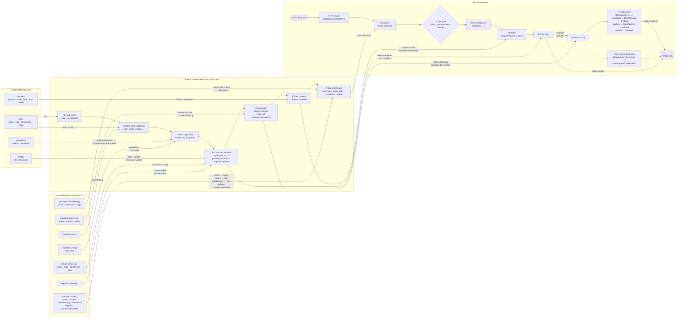

# Manifest → Runtime Flow

How `moduleforge.app.yaml` and `moduleforge.module.yaml` sections map into the
generated composition root and the per-request HTTP pipeline.

## Key field-to-flow mappings at a glance

| Manifest field | Where it appears at runtime |
|---|---|
| `infra.pool` | Shared `*pgxpool.Pool` — passed to every service and handler that lists `infra:pool` in `requires.infra` |
| `infra.cfg` | Shared `*config.Config` — fields accessed via `field:cfg.*` arg-sources |
| `closures.*` | Inline `func` variables emitted at the composition root; injected into handlers via `closure:<name>` arg-source |
| `migrations.range` | Determines run-order for migration files at startup (ordered by `range.first`, non-overlapping across modules) |
| `provides.services[]` | Service variables constructed once in topological dependency order; injected via `service:<name>` arg-source |
| `requires.services[]` | Declares cross-module wiring; the compiler validates exactly one provider exists and edges the dependency graph |
| `provides.observers[].service` | The service that implements `MutationObserver`; wrapped into the `ObserverGroup` |
| `provides.observers[].policy` | `propagate` → `MustObserve` (errors abort tx); `swallow` → `MayObserve` (errors logged); `default` → `Observe` |
| `provides.middleware[]` | Middleware constructors; referenced by name in `provides.routes[].middleware` and emitted as `r.Use(mw)` calls |
| `provides.routes[].prefix` | chi mount point — `r.Mount(prefix, ...)` or `r.Route(prefix, ...)` |
| `provides.routes[].scope` | `public` — no gate; `authenticated` — `RequireAuth` middleware; `verified` — `RequireAuth` + `RequireVerifiedEmail` |
| `provides.routes[].middleware[]` | Named middleware applied via `r.Use(...)` inside the route group, innermost scope only |
| `provides.routes[].register` | Pattern A: pre-built handler struct passed to `RegisterRoutes(r, handler)` |
| `provides.routes[].mountFromModule` | Pattern B: `NewRouter(deps)` returns a full `chi.Router`; emitted as `r.Mount(prefix, NewRouter(deps))` |
| `provides.routes[].innerMount` | `true` → emitted inside a parent module's `r.Route(prefix, ...)` block to avoid chi duplicate-mount panic |
