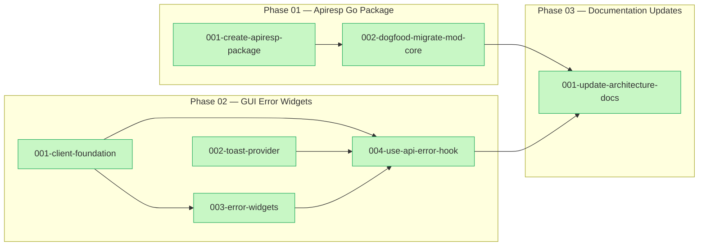
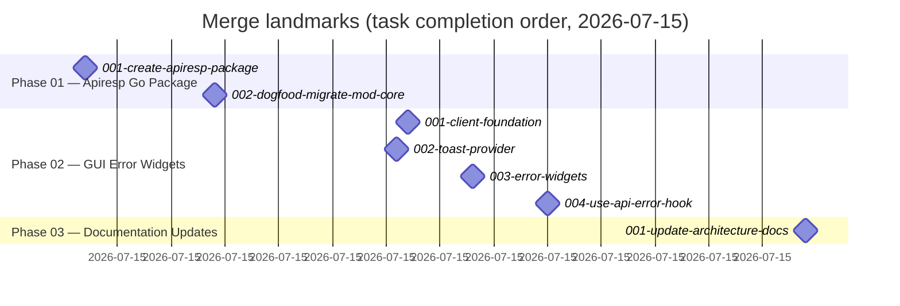

# Plan summary — API Response & Error Widgets (Wave 0 / Phase 2)

## Purpose and scope

This plan implemented phase 2 of the three-phase API response & error standardization effort (phase 1,
design + documentation, had already landed separately). The settled contract lives at
`docs/mf-standards/architecture/api-response-design.md` (submodule-mounted from the `docs-mf-standards`
repo) and served as the source of truth for shapes, sentinel names, function signatures, and
error-code vocabulary throughout.

Scope was mod-core only. The plan built the two deliverables the design doc specified as "phase 2,
design only": a new Go `api/apiresp` package providing the canonical sentinel set, a bare success
encoder, a sentinel-to-status/code mapper with nested-envelope encoding, and a field-error builder —
plus a dogfooding migration of mod-core's own HTTP surface onto it — and a `mod-core/gui` error/toast
widget toolkit (wire types, a typed `request()` client, `<FieldError>`/`<ErrorBanner>` widgets, a Toast
provider, and the `useApiError` classification hook), all exported from the `gui/src/index.ts` barrel.
A final documentation phase brought the repo-owned `AGENTS.md` and `README.md` into sync with both new
subsystems.

`model/` (the separate Go module), the design doc itself, other repos' response writers/sentinels/GUI
components, and `mod-users/gui/src/lib/api.ts` were explicitly out of scope and were not touched.

## What was done

### Phase 01 — Apiresp Go Package

- [001-create-apiresp-package.md](./phase-01-apiresp-go/001-create-apiresp-package.md) — Created the new
  `api/apiresp` package: the sentinel set (`ErrUnauthenticated`, `ErrForbidden`, `ErrNotFound`,
  `ErrInvalidInput`, `ErrConflict`), the `Envelope`/`ErrorBody`/`FieldError` wire types (`Details` with
  `omitempty`), `WriteJSON`, `WriteError` (`errors.Is` classification, nested-envelope encoding, 5xx
  `slog` logging including `opctx.RequestID`, no raw-text leak), and the `InvalidInput` field-error
  builder, with a full unit-test suite passing.
- [002-dogfood-migrate-mod-core.md](./phase-01-apiresp-go/002-dogfood-migrate-mod-core.md) — Migrated
  mod-core's own HTTP surface off the local `jsonOK`/`jsonErr`/`writeServiceErr` trio and local sentinel
  set onto `apiresp`: `api/service/errors.go` now aliases the canonical sentinels and adds `ErrConflict`;
  `api/httpapi/response.go` is reduced to `profileResponse`; all four handler files route through
  `apiresp.WriteJSON`/`apiresp.WriteError`; tests were updated to the nested envelope with new
  `ErrConflict` → 409 `conflict` coverage.

### Phase 02 — GUI Error Widgets

- [001-client-foundation.md](./phase-02-gui-error-widgets/001-client-foundation.md) — Built the
  mod-core/gui client foundation: wire types (`FieldError`, `ApiError`, `ApiErrorResponse`), the
  `ApiRequestError` class, and a shared typed `request()` fetch wrapper with `network_error`/status-0
  synthesis and the 401-redirect / 403-never-redirect split, behind an injectable
  `configureApiClient` auth seam.
- [002-toast-provider.md](./phase-02-gui-error-widgets/002-toast-provider.md) — Added a Toast provider
  surface (`ToastProvider`, `useToast`) wrapping the existing `radix-ui` Toast primitives with
  default/destructive variants matching `Alert`; no new dependency added.
- [003-error-widgets.md](./phase-02-gui-error-widgets/003-error-widgets.md) — Implemented the
  presentational `<FieldError>` (binds one `FieldError` to an input, `role="alert"`) and `<ErrorBanner>`
  (wraps the shared `Alert` `destructive` variant, the promotion of mod-users' `ErrorMessage`) widgets
  per the surface-classification table.
- [004-use-api-error-hook.md](./phase-02-gui-error-widgets/004-use-api-error-hook.md) — Implemented
  `useApiError`, the single place the design doc's surface-classification routing rule lives
  (field-bound vs banner vs toast-worthy, with `unauthenticated` excluded from inline handling and
  toast dispatch `useEffect`-guarded against duplicates), and finalized the `gui/src/index.ts` barrel
  exporting the complete Phase-02 toolkit.

### Phase 03 — Documentation Updates

- [001-update-architecture-docs.md](./phase-03-doc-updates/001-update-architecture-docs.md) — Updated
  `AGENTS.md` (new `apiresp/` row in the "Key types and packages" table, `service`/`httpapi` re-homing
  notes, a new "gui/ error and toast toolkit" subsection) and `README.md` ("What it provides" list) to
  reflect the new subsystems; confirmed the submodule-owned `docs/mf-standards` architecture/design docs
  were intentionally left untouched.

## Diagrams

<!-- For AI agents and non-visual readers: this graph shows the plan's phase/task structure as three subgraphs (Phase 01, Phase 02, Phase 03). Within Phase 01, task 001 feeds task 002. Within Phase 02, tasks 001 and 002 run in parallel with no dependency on each other; task 003 depends on task 001; task 004 depends on tasks 001, 002, and 003. Phase 01's task 002 and Phase 02's task 004 both feed into Phase 03's single task, reflecting that Phase 03 (documentation) depended on both implementation phases completing, while Phase 01 and Phase 02 themselves ran independently of each other. All seven tasks are marked done. -->

<!-- For AI agents and non-visual readers: this timeline plots the merge instant (as a zero-duration milestone) of each of the plan's seven completed tasks, grouped by phase, all landing within roughly a 70-minute window on 2026-07-15. It shows landing order rather than task duration: Phase 01's two tasks merged first (14:47 and 14:59), followed by Phase 02's four tasks merging in a tight cluster between 15:16 and 15:30 (consistent with tasks 001/002 running in parallel and 003/004 following), and Phase 03's single documentation task merging last at 15:54 after both implementation phases were complete. -->

## Git landmarks

| Task | Branch | Commit | Merge |
|------|--------|--------|-------|
| [001-create-apiresp-package.md](./phase-01-apiresp-go/001-create-apiresp-package.md) | `phase-01-task-01-create-apiresp-package` | `ba740fd` | `359e35be54a90cf688c9baeae3489bb4d188b429` |
| [002-dogfood-migrate-mod-core.md](./phase-01-apiresp-go/002-dogfood-migrate-mod-core.md) | `phase-01-task-02-dogfood-migrate-mod-core` | `9d531ff` | `9c9f1a92af6f662124f3a11c68611edfb256234e` |
| [001-client-foundation.md](./phase-02-gui-error-widgets/001-client-foundation.md) | `phase-02-task-01-client-foundation` | `cd00c60` | `ca9680ed85a7b197483e9f99759216bee77707c1` |
| [002-toast-provider.md](./phase-02-gui-error-widgets/002-toast-provider.md) | `phase-02-task-02-toast-provider` | `a89512f` | `3052492afcde7daec34a780b04581ceb473c9632` |
| [003-error-widgets.md](./phase-02-gui-error-widgets/003-error-widgets.md) | `phase-02-task-03-error-widgets` | `6d187a6` | `77b69ae457a6619f23aa324f103bef632720cdc5` |
| [004-use-api-error-hook.md](./phase-02-gui-error-widgets/004-use-api-error-hook.md) | `phase-02-task-04-use-api-error-hook` | `dc7a67f` | `39839e0a90586bb930cea8b43c08e42fd9b8ecdb` |
| [001-update-architecture-docs.md](./phase-03-doc-updates/001-update-architecture-docs.md) | `phase-03-task-01-update-architecture-docs` | `fabe6ad` | `2404591e6096d3c881f692f20485c9868c07c050` |

All seven branch/commit/merge hashes above resolved cleanly via `git rev-parse` from the plan worktree.

## Follow-ups

`plan/followups.yaml` records five open items (all dated 2026-07-15; no items are marked as blockers):

- **Service validation-reason text lost on 400s** (`phase-01-apiresp-go`) — Phase-01 correctness review:
  adopting `apiresp.WriteError` drops the specific validation-reason text (e.g. "legal_name is
  required") that existing service-layer `fmt.Errorf("%w: ...", ErrInvalidInput)` errors used to surface
  via `err.Error()` under the old `writeServiceErr`. `publicMessage` always substitutes a generic string
  for `invalid_input`, and these errors aren't built via `apiresp.InvalidInput` so they carry no
  structured `details[]`. Consistent with the design doc's general allowance for generic 4xx messages,
  but not explicitly scoped by either task doc. Decide: accept as a documented tradeoff, or follow up to
  route `api/service/{corporation,natural_person,service_account}.go`'s validation errors through
  `apiresp.InvalidInput(FieldError{...})` so the reason survives in `details[]`. See
  `api/apiresp/writer.go`, `api/httpapi/response.go`.
- **gui/ package has no test runner configured** (`phase-02-gui-error-widgets`) — Pre-existing gap (not
  introduced by this plan): `gui/` has no vitest/jest dependency or test script, though the React
  Developer role doc calls for component tests as a core responsibility. Sibling tasks 002/003 shipped
  without tests since neither task doc's Validation section required them. Decide whether/when to add a
  test runner to `gui/`.
- **Banner drops detail text when all-unbound** (`phase-02-gui-error-widgets`) — Phase-02 correctness
  review: in `useApiError`'s `classifyInline` (`gui/src/lib/use-api-error.ts` ~561-567), when `details[]`
  is non-empty but none match a rendered field, `bannerError` falls back to the generic top-level
  `{code,message}` rather than surfacing the specific unbound detail messages — even though the adjacent
  "some bound, some unbound" branch does surface them. The design doc's Surface classification table
  supports the current literal reading, but the asymmetry may be a product surprise. Decide: is
  generic-message-on-all-unbound intentional, or should it join unbound detail messages like the
  partial-match branch does?
- **request() has no origin check for token** (`phase-02-gui-error-widgets`) — Phase-02 security review:
  `request()` (`gui/src/lib/api-client.ts` ~106-119) attaches the bearer token to whatever URL the
  caller passes, with no same-origin/allow-listed-host check. Not exploitable from anything in this diff
  (no consumer wired yet) — risk depends entirely on how a future consumer calls `request()`. Consider
  an optional `allowedOrigins`/base-URL guard in `configureApiClient` or `request()`, or document the
  implicit same-origin assumption in the doc comment.
- **Default token storage uses localStorage** (`phase-02-gui-error-widgets`) — Phase-02 security review:
  the default `ApiClientAuthHandler` (`gui/src/lib/api-client.ts` ~50-60) stores/reads the bearer token
  via `window.localStorage`, readable by any script on the page (XSS-exfiltrable). Intentionally mirrors
  existing mod-users behavior per code comment, not a new regression; the `configureApiClient` seam
  already lets consumers substitute a safer strategy. No action needed now — revisit if/when the project
  moves toward httpOnly-cookie or in-memory-token storage.

### Incomplete tasks

None — all seven tasks across all three phases are marked `done: true` in the plan's task-tracking
state; no task remains outstanding.
